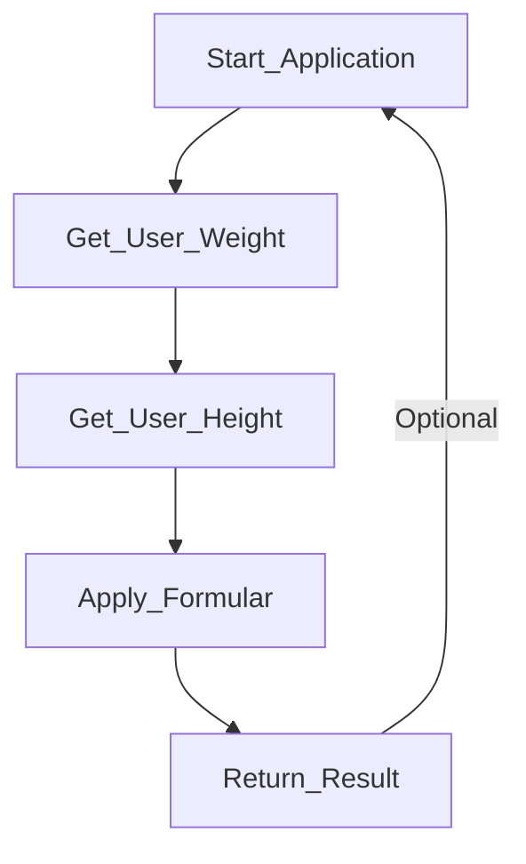

# BMI Calculator 🧮

#### You have probably heard all about the famous BMI ✨
🚨 *_Disclaimer_* 🚨 The BMI is **not** medically accurate   
and is **not** to be used as measure for ones health 👨🏻‍⚕️

### With that out the way 🚪 let's get started 🎬

#### How the BMI calculator works 💪🏼
BMI = weight(kg) / (height * height) (m^2)




#### Range of BMI 📈


| Underweight  | Normal | Overweight | Grade 1 Obesity | Grade 2 Obesity | Grade 3 Obesity |
| ----------- | ------ | ---------- | --------------- | --------------- | --------------- |
| \[0, 18.5)  | \[18.5, 24.9) | \[25, 29.9) | \[30, 34.9) | \[35, 39.9) | \[40, ∞) |

💡 Whith this list, you can check what category the BMI of the user falls in and return the respective result as well as the BMI, like so 👇🏼   
```go
fmt.Printf("Your BMI is %.2f, your weight is %s \n", bmi, status)
```
