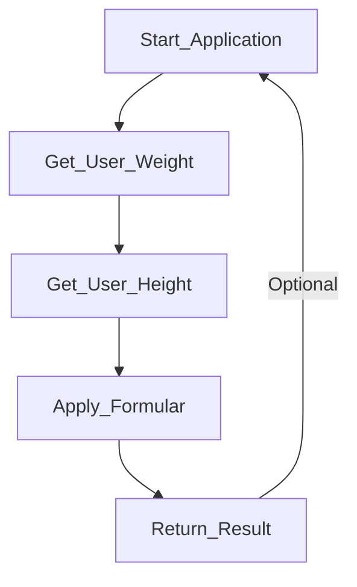

# BMI Calculator 🧮

#### You have probably heard all about the famous BMI ✨
🚨 *_Disclaimer_* 🚨 The BMI is **not** medically accurate   
and is **not** to be used as measure for ones health 👨🏻‍⚕️

### With that out the way 🚪 let's get started 🎬

#### How the BMI calculator works 💪🏼
BMI = weight(kg) / height * height (m^2)

