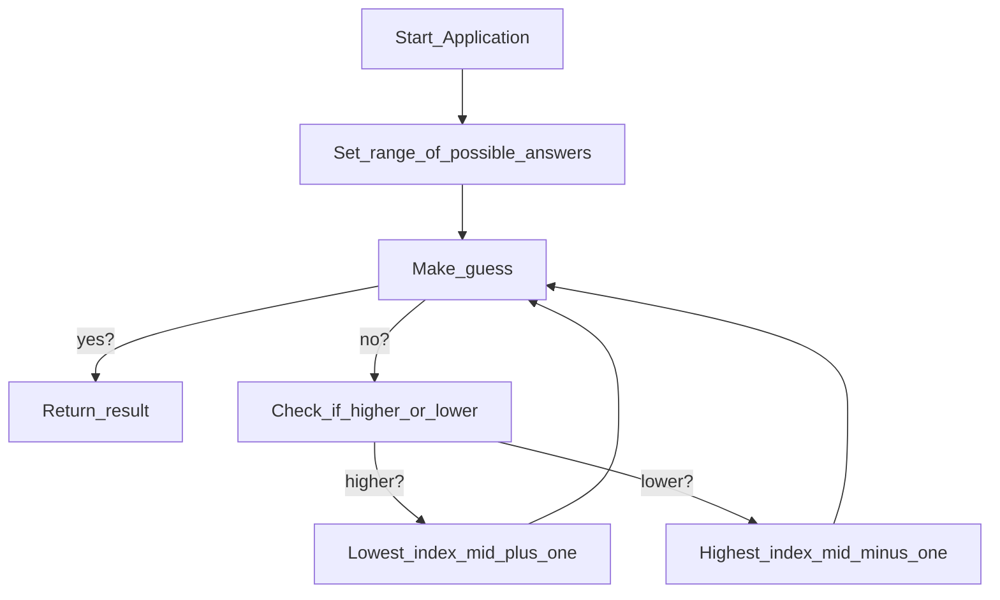

# Guessing game 🎯

#### Lets program a blazingly fast guessing game ✨
We will create a guessing game, which can guess any number withing log(n) times 🤯    
To elaborate what that means, our algorithm will have a time complexity that grows extremely slowly   
meaning it's an extremely efficent algorithm 💥

#### So how do we do that ? Lets look at our flowchart 📈

#### I know this looks a lot, but it actually isn't ⭐️
Essentially we first state within what range is the number we tought of      
for example: my number = 6, range is \[0, 10\]    
Then our computer makes a guess and checks if the guess was correct, too big or too small 🤔   
if it was too small we set the minimum index to the mid of the range plus one  
if it was too large we set the maximum index to the mid of the range minus one    
we repeat this process until the program has sucessfully guessed the number we thought of 🔁    

